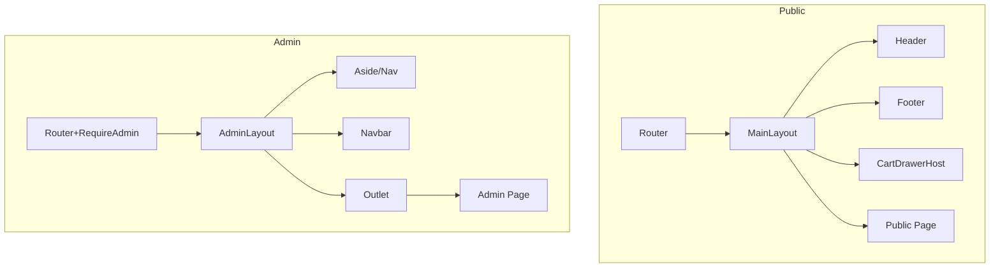

# Templates (`src/components/templates`)

Este directorio contiene las plantillas (layouts) que definen el armazón visual y arquitectónico de la aplicación:

- `MainLayout/` — Layout raíz para rutas públicas, con Header, Footer y Drawer del carrito.
- `AdminLayout/` — Layout del panel de administración, con navegación lateral, barra superior y área de contenido anidado.

## Estructura

```
src/components/templates/
├── AdminLayout/
│   ├── AdminLayout.tsx   # fuente TypeScript/React
│   └── AdminLayout.js    # artefacto compilado (no editar)
└── MainLayout/
    ├── MainLayout.tsx    # fuente TypeScript/React
    └── MainLayout.js     # artefacto compilado (no editar)
```

## Tecnologías y Dependencias

- React + TypeScript (`.tsx`): componentes de layout.
- `react-router-dom`: `Outlet`, `NavLink`, `Link` (en AdminLayout) para enrutamiento y navegación.
- `react-bootstrap`: `Navbar`, `Container`, `Nav` (AdminLayout).
- Alias de importación: `@templates`, `@organisms`, `@app` (definidos en `vite.config.ts`/`tsconfig.json`).
- Estilos: `src/styles/admin.css` para el panel admin; estilos globales en `src/styles/*`.

## Propósito y Flujo

- **MainLayout**
  - Proveedor del contexto de UI del carrito (`CartUIProvider`), accesible vía `useCartUI`.
  - Renderiza `Header`, `Footer` y el `CartDrawerHost` que controla el `CartDrawer`.
  - Contiene `{children}` de páginas públicas dentro de `<main>`.

- **AdminLayout**
  - Define aside con enlaces a secciones admin y una barra superior.
  - Usa `<Outlet />` para renderización de rutas anidadas (dashboard, productos, etc.).
  - Integra estilos específicos `admin.css`.

## Arquitectura y Relaciones

- Rutas públicas: `MainLayout` se usa como layout raíz bajo `RootLayout` en `src/app/router.tsx`.
- Rutas admin: protegidas por `RequireAdmin`, y envueltas por `AdminLayout` para navegación y estructura.

Diagrama de relación:



## Instrucciones de Uso

- Importa layouts con alias `@templates/...`.
- No edites archivos `.js`; realiza cambios en `.tsx`.
- Para añadir una nueva sección admin, crea la página en `src/components/pages/Admin` y enlázala desde `AdminLayout` (aside) y `router.tsx`.

## Estándares de Documentación

- Añade encabezado JSDoc al inicio del archivo con:
  - Nombre del template, Propósito, Props, Dependencias, Hooks, Ejemplo de uso.
- Documenta bloques relevantes (navegación, provider, outlet) con comentarios breves y claros.

## Mejoras Potenciales

- Centralizar la configuración del menú admin (objeto de rutas) para coherencia.
- Lazy-load de `CartDrawer` para reducir peso inicial si el Drawer es costoso.
- Añadir atributos ARIA y roles adecuados en navegación admin para accesibilidad.
- Reemplazar el mock de `localStorage.isAdmin` por autenticación real.
- Auditar `admin.css` para eliminar reglas no usadas y aplicar buenas prácticas de especificidad.

